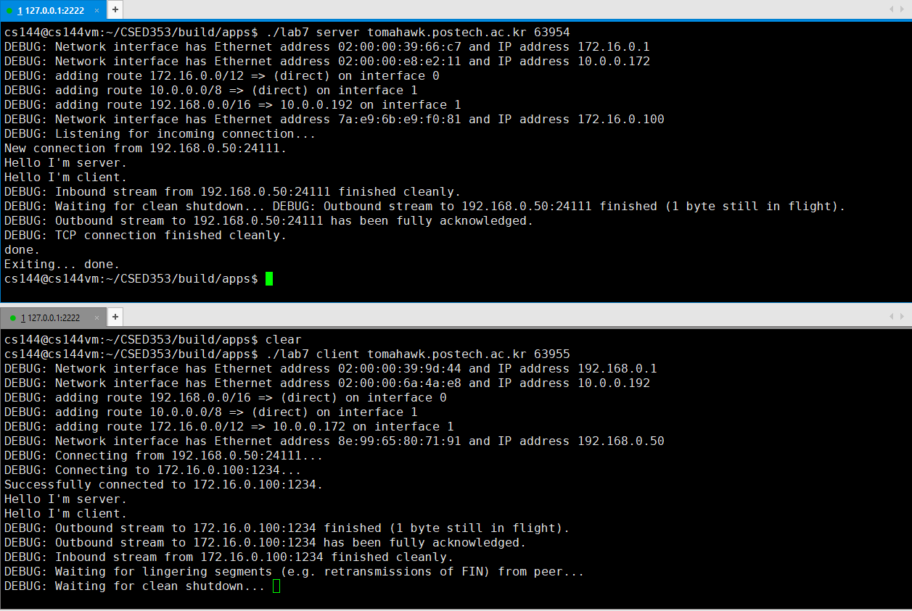
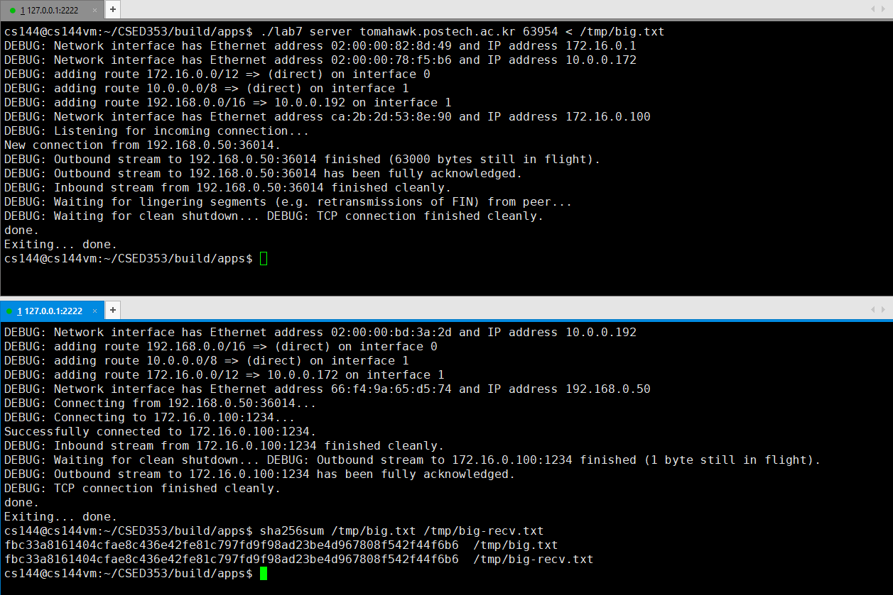

Assignment 7 Writeup
=============

My name: Changhun Oh

My POVIS ID: pcsech16

My student ID (numeric): 20160779

My assignment partner's name: Soomin Choi

My assignment partner's POVIS ID: choisium

My assignment partner's ID (numeric): [your partner's student id here]

This assignment took me about 1 hours to do (including the time on studying, designing, and writing the code).

If you used any part of best-submission codes, specify all the best-submission numbers that you used (e.g., 1, 2): I do it all alone.

## 1. Solo portion
+ Did your implementation successfully start and end a conversation with another copy of itself?

    Yes, it did.
    
+ Did it successfully transfer a one-megabyte file, with contents identical upon receipt?

    I received one-megabyte fild successfully and both server and client had same contents.
    
+ Please describe what code changes, if any, were necessary to pass these steps
    
    There has been no change in my code since assn6.

## 2. Group portion
+ What is your team’s name? Who is your partner (and what is their POVIS ID)?

    My teams' name is **Metcalfe** and my parter is **Soomin Choi** and her POVIS ID is **choisium**.

+ Did your implementations successfully start and end a conversation with each other (with each implementation acting as “client” or as “server”)?

+ Did you successfully transfer a one-megabyte file between your two implementations, with contents identical upon receipt?

+ Please describe what code changes, if any, were necessary to pass these steps, either by you or your partner.

    There has been no change in my code since assn6.

## 3. Creative portion

## 4. Other remarks
I can't find any bugs and remarkable points in this assignment.

- Optional: I had unexpected difficulty with: There is no difficulty.

- Optional: I think you could make this assignment better by: It is enough good to study.

- Optional: I was surprised by: This assignment is well designed.

- Optional: I'm not sure about: Nothing about it.
